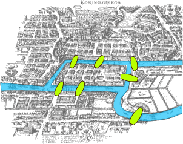
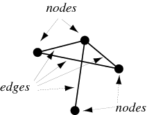
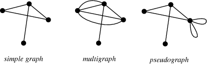
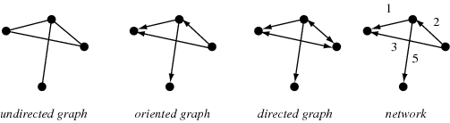
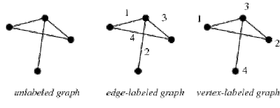
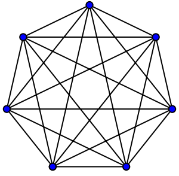
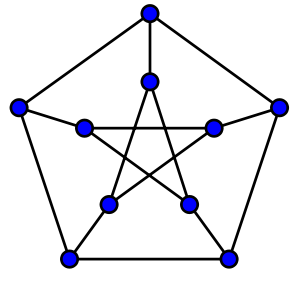
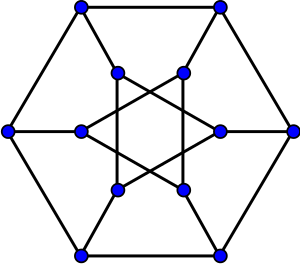
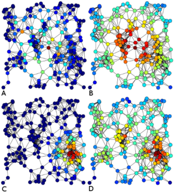

Working with Network Data in Gephi
============================

---

**Instructor:** Simon&nbsp;Wiles&nbsp;(simon.wiles@stanford.edu)

> This workshop will introduce you to working with data that can be represented as a network graph.  We'll cover why and how to organize data in terms of networks as well as some of the tools that are available for working with networks and graphs.  In particular, the workshop will feature a hands-on tutorial on using Gephi (https://gephi.org/) to explore, analyze, and visualize network data.

---

# 0. Workshop Setup

## Installing Gephi

!!! instruction ""
    Go to [the Gephi home page](https://gephi.org/){target="_blank"} and download the distribution appropriate for your operating system.

    * **Windows**
    	* If you don't have Java installed (you'll need version 7 or 8), please install version 8 from [this link](https://www.java.com/en/download/).
    	* Run the downloaded installer and follow the steps in the Setup Wizard.
    * **Mac**
        * Open the `.dmg` file, drag the Gephi icon to your Applications folder, and the double-click to run it.
    * **Linux**
        * Ensure you have a Java JRE installed (version 7 or 8).
        * Extract the tarball and execute `./bin/gephi`.

## Getting Sample Data

!!! instruction ""
    Download the sample data pack `sample_data.zip` using [this link](), and extract it somewhere you can find it on your computer.

---

# 1. Why Network Graphs?

* Visualizing and analyzing network graphs for research:
    * exploring, investigating, and analysing data
    * diagnosing, finding errors, and “sanity checking”

* Visualizing network graphs for presenting and communicating data and findings:
	* static visualizations for print/web etc.
	* interactive visualizations for web and other digital platforms

---

# 2. A Brief Intro. to Graph Theory and Social Network Analysis

## The Seven Bridges of Königsberg

{.center}

Graph theory begins with the work of Swiss genius Leonard Euler in the mid-18th century.
> "Can I walk through Königsberg such that I cross each of its seven bridges once and only once?"

## Social Network Analysis
Social network analysis examines the structure of relationships between social entities. These entities are often persons, but may also be groups, organizations, nation states, web sites, scholarly publications. 

Since the 1970s, the empirical study of networks has played a central role in social science, and many of the mathematical and statistical tools used for studying networks have been first developed in sociology. Amongst many other applications, social network analysis has been used to understand the diffusion of innovations, news and rumors. Similarly, it has been used to examine the spread of both diseases and health-related behaviors. It has also been applied to the study of markets, where it has been used to examine the role of trust in exchange relationships and of social mechanisms in setting prices. Similarly, it has been used to study recruitment into political movements and social organizations. It has also been used to conceptualize scientific disagreements as well as academic prestige. More recently, network analysis (and its close cousin traffic analysis) has gained a significant use in military intelligence, for uncovering insurgent networks of both hierarchical and leaderless nature. In criminology, it is being used to identify influential actors in criminal gangs, offender movements, co-offending, predict criminal activities and make policies. 

## Key Terms

{.pull-right}

* **Graphs**  
   A collection of nodes and edges that collect some (or none) of them.
   
* **Nodes** (a.k.a. _vertices_, _points_, _actors_ etc.)

* **Edges** (a.k.a. _arcs_, _links_, _lines_, _connections_, _relationships_ etc.)

## Data
The first step in working with network graphs is wrangling our data into an appropriate format.

* A lists of edges (mandatory)
* A list of nodes (optional)
* Additional attributes and metadata
    - Edge types / weights

## Types of Graphs
Graphs may be:

* Simple graphs, multigraphs, or pseudo-graphs
{.center}

* Undirected, oriented, or directed
{.center}

* Connected or unconnected
{.center}

* Labeled or unlabeled
{.center}

---

# 3. Software and Data Formats
Lots of different software packages are available to help you manage, analyze, and visualize network data.  Below are few you might be likely to encounter, and that you might consider for your own work.

## Desktop Packages
The following are all open-source, cross-platform desktop applications that provide a graphical user interface (GUI) for working with graphs and network data.

| | |
|:-:|:-:|
| {target="_blank"} | {target="_blank"} |
| {target="_blank"} | {target="_blank"} |
| [ Tulip](https://tulip.labri.fr/TulipDrupal/){target="_blank"}

## Libraries and Frameworks

* [Graphviz](https://www.graphviz.org/){target="_blank"}
* [iGraph](https://igraph.org/){target="_blank"}

* Python
    - [NetworkX](http://networkx.github.io/)
    - [Python interface to Graphviz](https://pypi.org/project/graphviz/){target="_blank"}
    - [Python interface to iGraph](https://pypi.org/project/python-igraph/){target="_blank"}

* R
    - [sna: Tools for Social Network Analysis](https://www.rdocumentation.org/packages/sna/){target="_blank"}
    - [R interface to Graphviz](https://www.rdocumentation.org/packages/Rgraphviz/){target="_blank"}
    - [R interface to iGraph](https://www.rdocumentation.org/packages/igraph/){target="_blank"}

* Others
    - [NodeXL](http://nodexlgraphgallery.org/)  
      NodeXL is a free plugin for Microsoft Excel (Windows only).  It's fairly limited but may be useful for fairly small datasets and makes entering and editing data extremely easy for those who are used to Excel.  NodeXL also provides some unique visualizations and the ability to import data from social networks (?); it does not scale well to networks of more than a few thousand nodes and edges.

## Data Formats

* Tabular Data (e.g. CSV etc.)
* Dot language
* XML-based formats 
    - Graph Modelling Language
    - GraphML
    - GEXF
* and more (RDF, GML, GraphSON, etc.)

---

# 4. Getting Started with Gephi

!!! instruction ""
    Open Gephi, create a "New Project"

* The Gephi UI is broken up into 3 main screens
    - Overview
    - Data Laboratory
    - Preview

* Panels on the Overview screen
    * Filters
    * Statistics
    * Appearance
    * Layout
    * Graph

## Loading Data

!!! instruction ""
    * Go to the **Data Laboratory** view, and use the **Import Spreadsheet** function to load a **Nodes** table and an **Edges** table from `letters.nodes.csv` and `letters.edges.csv` respectively.
    * Make sure to select **`Append to existing workspace`**.
    * Switch to the **Overview** window.

---

# 5. Network Visualization
Initially, Gephi will draw your graph with nodes positioned at random in square configuration.  It's not terribly useful.

!!! instruction ""
    * Begin by selecting **Nodes** in the **Appearance** panel, and selecting the color options.  The default setting is **Unique**, with a color value of `#c0c0c0` -- change the color if you wish, and hit **Apply**.
    * Adjust the **Edge Weight Scale** all the way down, so that the edges don't obscure the nodes.
    * Then select the size options, switch to **Ranking**, and choose `Degree` as the attribute.  Specify **Min size** as `10`, and **Max size** as `100`.  Hit **Apply**.

We can pan and zoom, and use the **Center on Graph** magnifying-glass button if we get lost.

## Layout
Graphs can be laid-out by hand (using the **Drag** tool), but typically we will prefer to use automatic layout algorithms.

The mathematics of graph-spreading algorithms is a deep and complex topic drawing graph theory as well as on computational geometry and discrete mathematics (see, e.g. http://www.graphdrawing.org/).  Fortunately for us, packages like Gephi and the others mentioned above implement the best of these algorithms and make them available for us to use in an interactive way.  Less fortunately, they are still not entirely straightforward to use.

**Force-Directed Algorithms**

* **Fruchtermann-Reingold**  
  A classic node-spreading algorithm that disperses nodes according to patterns of attraction and repulsion based on minimizing the total energy of a physical system in which nodes are mass particles and edges are springs between the particles.
    * Does not take account of edge weight.
    * Suitable only for graphs of around 1,000 nodes or smaller.
* [**Yifan-Hu (Proportional)**](http://yifanhu.net/PUB/graph_draw_small.pdf)  
  A force-directed model alongside a multi-level a graph coarsening technique, resulting in an algorithm which is fast enough to be suitable for large graphs while still producing good quality results.
    * Does not take account of edge weight.
    * Not suitable for use with graphs > 100,000 nodes.
* **ForceAtlas**  
  Force-directed algorithm developed specifically for use in Gephi which is intended for use on smaller, highly-connected graphs.
    * Uses edge weights.
    * Up to ~10,000 nodes.
* [**ForceAtlas2**](https://journals.plos.org/plosone/article?id=10.1371/journal.pone.0098679)  
  "Improved" version of the original ForceAtlas algorithm in which node repulsion is approximated by a scaling factor, allowing it to work with much larger networks.
    * Uses edge weights.
    * Up to ~1,000,000 nodes.  
* **OpenOrd**  
  Works best with undirected weighted graphs and aims to better distinguish clusters.
    * Uses edge weights.
    * Appropriate for larger networks ~100 - ~1,000,000 nodes.

**Other Layout Algorithms**

* Geographic Layout
* Circular / Radial Axis
* Circle-Packing
* etc.

**Graphic Adjustments**

* Geometric Transformation
    - Expansion / Contraction
    - Rotation
* Noverlap
* Label Adjust

* Random

All of these layout algorithms have parameters that we can adjust and tweak, and they usually require a bit of experimentation to get them as we would like for a given network.

!!! instruction ""
    * Choose the **Fruchtermann-Reingold** layout algorithm.  Set the **Area** setting to `20000.0`, and the **Speed** to `10.0`.  The **Gravity** setting should remain at `10.0`.  Hit **Run**.
    * Some layouts, including Fruchtermann-Reingold, will continue to run indefinitely, so when the network has begin to stabilize, click **Stop**.
    * The Fruchtermann-Reingold output can look a little messy, as nodes will overlap -- we can neaten up the appearance if we wish by applying the **Noverlap** layout to our result.

With this visualization we can begin to see some clustering emerging with this layout.  A **ForceAtlas** approach should highlight these aspects of the network and make them more apparent.

!!! instruction ""
    * Choose the **ForceAtlas 2** layout algorithm.  Check the **Prevent overlap** box and uncheck the **Approximate repulsion** box.  Also change the **Scaling** setting to `50.0`.  Click the **Run** button.
    * Again, when the network has stabilized, hit **Stop**.
    * Depending on orientation of the network, we may wish to apply the **Rotate** layout to make viewing more convenient.
    

## Other Formatting

**Labels**

---

# 6. Network Statistics

The spacialization of the nodes in our graph renders information about the nodes and edges in the network.  We have also set the size of the nodes to reflect the _degree_ values of nodes.  Now we'd like to use the color of the nodes to represent some other network statistics -- but first, we'll need to calculate them.

* **Geodesic Distance between two nodes**  
  _The shortest path between nodes, counted in terms of edges._

## Network Metrics
* **Density**  
  _The ratio of the number of edges to the number of possible edges in the network._
* **Average Degree**  
  _The ratio of the number of edges to the number of nodes in the network._  For undirected graphs, each edge is counted twice (i.e. as in-bound _and_ out-bound) when calculating average degree.
* **Diameter**  
  _The longest of all the calculated shortest paths in the network._
* **Average Geodesic Distance** (a.k.a. _characteristic path length_, _average path length_)  
  _The average over the shortest paths between all pairs of nodes._  
* **Clustering Coefficient**  
  _The average of the clustering coefficients of all the nodes._  The clustering coefficient of a node is the ratio of edges connecting a node's immediate neighbors to each other to the maximum possible number of such edges.

| | | |
|:-:|:-:|:-:|
|  |  |  |
| Nodes: 7 | Nodes: 10 | Nodes: 12 |
| Edges: 21 | Edges: 15 | Edges: 18 |
| Density: 21/21 == 1 | Density: 15/45 == 0.33 | Density: 18/66 == 0.27 |
| Avg. Degree: 42/7 == 6 | Avg. Degree: 30/10 == 3 | Avg. Degree: 36/12 == 3 |
| Diameter: 1 | Diameter: 2 | Diameter: 4 |
| Avg. Geodesic Dist.: 1 | Avg. Geodesic Dist.: 1.67 | Avg. Geodesic Dist.: 2.045 |
| Clustering Coef.: 1 | Clustering Coef.: 0 | Clustering Coef.: 0.167 |

## Node Metrics

Node metrics are usually concerned with trying in different ways to assess the relative significance of nodes in the network.  "Which nodes in the network should be targeted to ensure that a message or information spreads to all or most nodes in the network?" or conversely, "Which nodes should be targeted to curtail the spread of a disease?"

**Degree**  
The _degree_ of a node is the number of edges that are incident to it.

* For _**directed**_ graphs, _**in-degree**_ and _**out-degree**_ count those edges of which the node is the target and the source respectively.
* For graphs with weighted edges, _**weighted degree**_ (and _**weighted in-degree**_ / _**weighted out-degree**_) take account of the those weights.

!!! instruction ""
    Because this network is _directed_, the unqualified _degree_ value indicated by the size of the nodes is an aggregation of the in-bound connections and the out-bound connections.  Furthermore, it is a naïve sum of all those connections, without regard for their individual weight.

    * On the **Statistics** panel, find **Avg. Weighted Degree**, and click the **Run** button next to it.  This calculates the appropriate statistic and adds a new column to our data table.
    * On the **Appearance** panel, select **Nodes** and open the color settings.  Choose **Ranking**, and select the attribute `Weighted In-Degree`.  Click **Apply**.

    Notice that the nodes with the highest _**degree**_ (the largest nodes) are not universally those with the highest _**in-degree**_ (the lightest color).

**Centrality**  

{.pull-left}

* **Betweenness** -- on most shortest paths **(A)**  
  _the number of times a node acts as a bridge along the shortest path between two other nodes_
* **Closeness** -- closeness to other nodes **(B)**  
  _the average length of the shortest path between a node and all other nodes in the graph_
* **Eigenvector** -- connected to well-connected nodes **(C)**
* **Degree** -- number of connections **(D)**

!!! instruction ""
    * To generate the centrality statistics for each of our nodes, find **Network Diameter** on the **Statistics** panel, and click the **Run** button next to it.
    * On the **Appearance** panel, select **Nodes** and open the color settings.  Choose **Ranking**, and select the attribute `Betweenness Centrality`.  Click **Apply**.

    Notice again that the nodes with the highest _**degree**_ are not universally those with the highest _**betweenness centrality**_.

**Influence**  
> Limitations to centrality measures have led to the development of more general measures. Two examples are the **accessibility**, which uses the diversity of random walks to measure how accessible the rest of the network is from a given start node, and the **expected force**, derived from the expected value of the force of infection generated by a node. Both of these measures can be meaningfully computed from the structure of the network alone. 

**Modularity**  
Gephi includes an implementation of an algorithm that can calculate modularity classes which can be used to identify subdivisions in a network.  In Social Network Analysis, these subdivisions are usually referred to as **communities**.

!!! instruction ""
    * To generate the modularity classes, click the **Run** button next to **Modularity** in the **Statistics** panel.
    * On the **Appearance** panel, select **Nodes** and open the color settings.  Choose **Partition**, and select the attribute `Modularity Class`.  Click **Apply**.

## Considerations when Analyzing Networks
https://journals.plos.org/ploscompbiol/article?id=10.1371/journal.pcbi.1007434

# 7. Publishing Visualizations

## The Preview screen

## Print

## On the Web

## Gephi Plugins
* GeoLayout
* Sigma/JS...

